# 🛡️ Real-Time Transaction Fraud Prediction System

<p align="center">
  
  
  
  
</p>

<h1 align="center">💳 Real-Time Transaction Fraud Prediction System</h1>

<p align="center">
  <strong>Machine Learning Based Transaction Fraud Detection & Risk Analytics</strong>
</p>

<p align="center">
  An end-to-end Machine Learning project for identifying fraudulent financial transactions using behavioral features, statistical risk modeling, and multiple classification algorithms.
</p>

---

## 🌍 1. Real-World Problem

<p align="center">
  
</p>

Financial fraud is one of the major challenges faced by banks, fintech companies, digital payment platforms, and financial institutions.

Every day, millions of transactions are generated. Only a small percentage of these transactions may actually be fraudulent.

The challenge is to automatically identify suspicious transactions while allowing legitimate transactions to continue normally.

### 🏦 Real-World Scenario

A customer makes a transaction:

```text
Customer
   │
   ▼
💳 Financial Transaction
   │
   ├── 💰 Amount
   ├── ⏰ Transaction Time
   ├── 🏦 Provider
   ├── 🛒 Product
   ├── 📱 Channel
   ├── 💱 Currency
   └── 👤 Customer History
            │
            ▼
      🤖 Fraud Detection Model
            │
       ┌────┴────┐
       ▼         ▼
    🟢 Genuine  🔴 Fraud
```

The Machine Learning model learns patterns from historical transactions and estimates whether a transaction is likely to be fraudulent.

---

## 🎯 2. Project Objective

<div align="center">

<table>
<tr>
<td align="center" width="50%">

### 🟢 Legitimate Transaction

A normal transaction that follows expected customer and transaction behavior.

</td>

<td align="center" width="50%">

### 🔴 Fraudulent Transaction

A transaction whose characteristics indicate potentially suspicious or fraudulent behavior.

</td>
</tr>
</table>

</div>

### Main Objective

The main objective of this project is:

> **To develop and evaluate Machine Learning models capable of distinguishing fraudulent financial transactions from legitimate transactions.**

The project focuses on:

- 🔍 Understanding transaction data
- 🧹 Data preprocessing
- 📊 Exploratory Data Analysis
- ⚙️ Feature Engineering
- ⚖️ Weight of Evidence (WoE)
- 📈 Information Value (IV)
- 🔬 Feature Selection
- 🤖 Machine Learning Model Training
- 📊 Model Evaluation
- 🧪 Probability Calibration
- 📉 Population Stability Analysis

---

# 🔄 3. Complete Project Flow

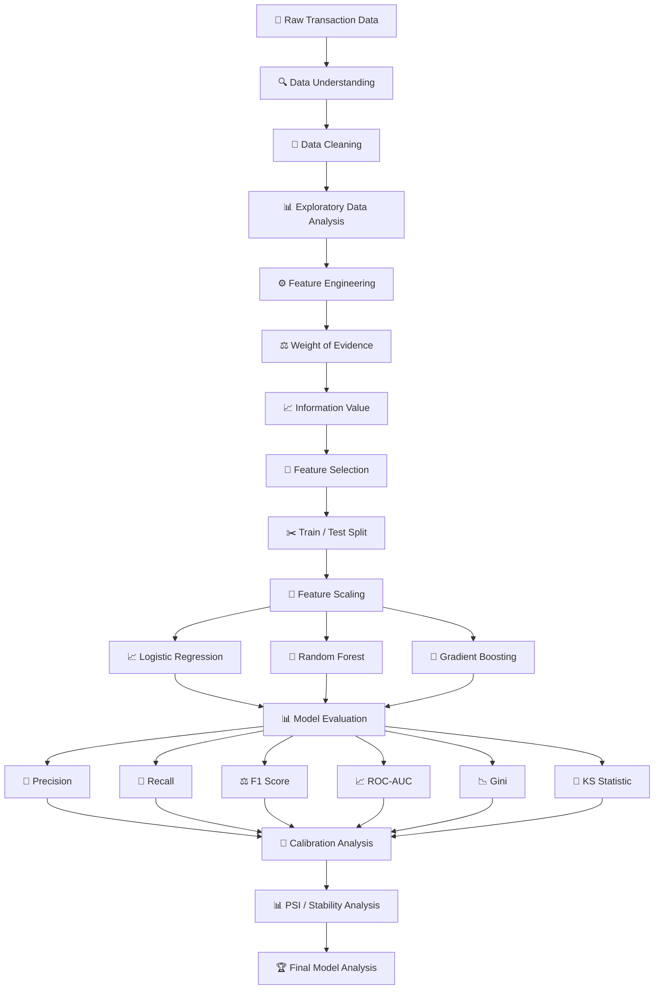

---

# 🧩 4. Project Architecture

```mermaid
flowchart LR

A["📂 DATA<br/>Transaction Records"] --> B["🧹 DATA<br/>PREPROCESSING"]

B --> C["⚙️ FEATURE<br/>ENGINEERING"]

C --> D["📊 RISK<br/>ANALYTICS"]

D --> E["🔬 FEATURE<br/>SELECTION"]

E --> F["🤖 MACHINE<br/>LEARNING"]

F --> G["📈 MODEL<br/>EVALUATION"]

G --> H["🧪 CALIBRATION"]

H --> I["📊 STABILITY<br/>ANALYSIS"]

I --> J["🏆 FINAL<br/>ANALYSIS"]

classDef data fill:#DDEBFF,stroke:#2563EB,stroke-width:2px,color:#111827;
classDef process fill:#DCFCE7,stroke:#16A34A,stroke-width:2px,color:#111827;
classDef risk fill:#FEF3C7,stroke:#D97706,stroke-width:2px,color:#111827;
classDef model fill:#F3E8FF,stroke:#9333EA,stroke-width:2px,color:#111827;
classDef eval fill:#FFE4E6,stroke:#E11D48,stroke-width:2px,color:#111827;
classDef final fill:#CCFBF1,stroke:#0F766E,stroke-width:2px,color:#111827;

class A data;
class B,C process;
class D,E risk;
class F model;
class G,H,I eval;
class J final;
```

---

# 📚 5. Project Methodology

The project follows a complete Machine Learning workflow:

| Stage | Purpose |
|---|---|
| 📂 Data Loading | Load historical transaction data |
| 🔍 Data Understanding | Understand dataset structure and variables |
| 🧹 Data Cleaning | Handle missing and inconsistent values |
| 📊 EDA | Understand transaction and fraud patterns |
| ⚙️ Feature Engineering | Create meaningful behavioral features |
| ⚖️ WoE | Transform categorical/binned variables |
| 📈 IV | Measure predictive strength |
| 🔬 Feature Selection | Select useful variables |
| ✂️ Train/Test Split | Separate training and evaluation data |
| 📐 Scaling | Normalize numerical variables where required |
| 🤖 Model Training | Train multiple classification models |
| 📊 Evaluation | Measure classification performance |
| 🧪 Calibration | Evaluate probability quality |
| 📉 PSI | Evaluate population stability |
| 🏆 Final Analysis | Compare model performance |

---

# 📂 6. Dataset

The project works with historical financial transaction data.

The dataset contains information related to:

- 👤 Customer
- 💰 Transaction Amount
- 💵 Transaction Value
- 🏦 Provider
- 🛒 Product
- 💱 Currency
- 📱 Channel
- ⏰ Transaction Time
- 🚨 Fraud Indicator

The target variable is:

```text
FraudResult
```

### Target Encoding

| Value | Meaning |
|---:|---|
| `0` | 🟢 Genuine Transaction |
| `1` | 🔴 Fraudulent Transaction |

---

# 🔍 7. Data Understanding

Before training the Machine Learning models, the dataset is explored to understand its structure and quality.

The analysis includes:

### 📌 Dataset Structure

- Number of observations
- Number of variables
- Data types
- Numerical variables
- Categorical variables

### 📌 Data Quality

- Missing values
- Duplicate records
- Unique categories
- Invalid values
- Outliers

### 📌 Target Distribution

The project examines the distribution between:

```text
🟢 Genuine Transactions
        vs
🔴 Fraudulent Transactions
```

This is especially important because fraud datasets are typically highly imbalanced.

---

# ⚠️ 8. Class Imbalance

Fraud detection is a classic **imbalanced classification problem**.

Conceptually:

```text
🟢 Genuine Transactions

████████████████████████████████████████████████████████


🔴 Fraudulent Transactions

█
```

This means that legitimate transactions significantly outnumber fraudulent transactions.

Therefore, accuracy alone is not sufficient to evaluate the model.

### Example

Suppose:

```text
99% → Genuine
 1% → Fraud
```

A model that predicts every transaction as genuine could achieve approximately:

```text
Accuracy ≈ 99%
```

but:

```text
Fraud Recall = 0%
```

Such a model would not be useful for fraud detection.

Therefore, this project evaluates:

- Precision
- Recall
- F1 Score
- ROC-AUC
- Gini
- KS Statistic

---

# 📊 9. Exploratory Data Analysis

Exploratory Data Analysis is used to understand transaction behavior before model development.

The analysis focuses on:

### 💰 Transaction Amount

Understanding the distribution of transaction values.

### 🚨 Fraud Distribution

Comparing legitimate and fraudulent transaction counts.

### 👤 Customer Behavior

Understanding transaction patterns across customers.

### ⏰ Transaction Timing

Analyzing transaction behavior across:

- Hour
- Day
- Month

### 🏦 Categorical Variables

Analyzing variables such as:

- Provider
- Product
- Currency
- Channel
- Pricing Strategy

---

# ⚙️ 10. Feature Engineering

Raw transaction variables may not completely capture customer behavior.

Therefore, additional behavioral and risk-related features are created.

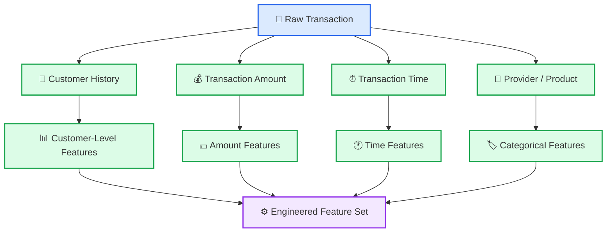

---

# 👤 11. Customer-Level Features

Customer behavior is an important component of fraud detection.

The project creates customer-level behavioral features such as:

### 💰 TotalTransactionAmount

Measures the total amount associated with a customer.

```text
TotalTransactionAmount
=
Sum of Customer Transaction Amounts
```

This helps capture the overall transaction activity of a customer.

---

### 📊 AverageTransactionAmount

Measures the typical transaction size of a customer.

```text
AverageTransactionAmount
=
Total Transaction Amount
/
Transaction Count
```

A transaction significantly larger than a customer's historical average may indicate unusual behavior.

---

### 🔢 TransactionCount

Measures how many transactions a customer performs.

A sudden increase in transaction frequency may represent abnormal behavior.

---

### 📉 TransactionAmountStd

Measures the variability of a customer's transaction amounts.

For example:

```text
Normal Pattern

₹500
₹700
₹600
₹800
₹650
```

versus:

```text
Potentially Unusual Pattern

₹500
₹700
₹600
₹800
₹50,000
```

The second pattern has much higher variability.

---

# ⏰ 12. Time-Based Features

Transaction timestamps can contain useful behavioral information.

The project extracts temporal variables such as:

```text
TransactionHour
TransactionDay
TransactionMonth
```

These features allow the model to learn patterns related to transaction timing.

### Example

```text
Expected Activity
       ↓
Normal transaction timing
       ↓
Lower risk signal
```

versus:

```text
Unexpected Activity
       ↓
Unusual transaction timing
       ↓
Potential risk signal
```

---

# ⚖️ 13. Weight of Evidence — WoE

Weight of Evidence is a statistical transformation commonly used in risk modeling.

WoE measures how strongly a category or bin is associated with the two target classes.

Conceptually:

```text
                 WoE
                  │
        ┌─────────┴─────────┐
        ↓                   ↓
 Legitimate Pattern    Fraud Pattern
        │                   │
        └─────────┬─────────┘
                  ↓
          Numerical Value
```

WoE is particularly useful for:

- Categorical variables
- Binned numerical variables
- Risk scoring
- Interpretable models
- Logistic Regression

---

# 📈 14. Information Value — IV

Information Value measures the predictive strength of a variable.

The general workflow is:

```text
Variable
   ↓
Create Bins / Categories
   ↓
Calculate Distribution
   ↓
Calculate WoE
   ↓
Calculate IV
   ↓
Measure Predictive Strength
```

The purpose is to identify variables that contain useful information for distinguishing:

```text
🟢 Genuine
      vs
🔴 Fraud
```

---

# 🔬 15. Feature Selection

The project applies multiple feature-selection approaches.

### 1️⃣ Information Value

Used to identify variables with predictive information.

### 2️⃣ VIF

Variance Inflation Factor is used to identify multicollinearity between numerical features.

### 3️⃣ Lasso

L1 regularization is used for feature selection.

The overall process is:

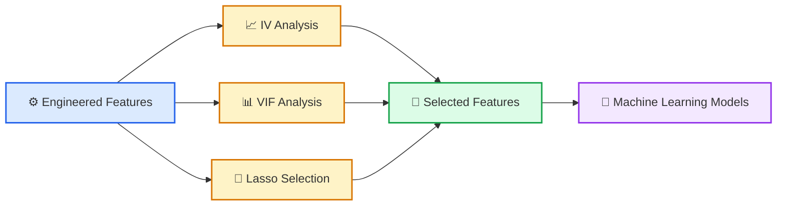

---

# ✂️ 16. Train-Test Split

After feature preparation, the data is divided into training and testing datasets.

```text
                 Complete Dataset
                        │
                        ▼
               ┌────────────────┐
               │ Train / Test   │
               │     Split      │
               └───────┬────────┘
                       │
              ┌────────┴────────┐
              ▼                 ▼
       🟦 Training Set     🟨 Testing Set
              │                 │
              ▼                 ▼
       Model Training      Final Evaluation
              │                 │
              └────────┬────────┘
                       ▼
                 📊 Performance
```

The training set is used to learn patterns.

The testing set is used to evaluate the model's performance on unseen observations.

---

# 📐 17. Feature Scaling

Feature scaling is applied where required by the modeling approach.

For example:

```text
Original Features
       ↓
StandardScaler
       ↓
Scaled Features
       ↓
Machine Learning Model
```

Scaling helps ensure that numerical variables are represented on comparable scales for models that are sensitive to feature magnitude.

---

# 🤖 18. Machine Learning Models

Three major classification models are evaluated:

1. 📈 Logistic Regression
2. 🌳 Random Forest
3. 🚀 Gradient Boosting

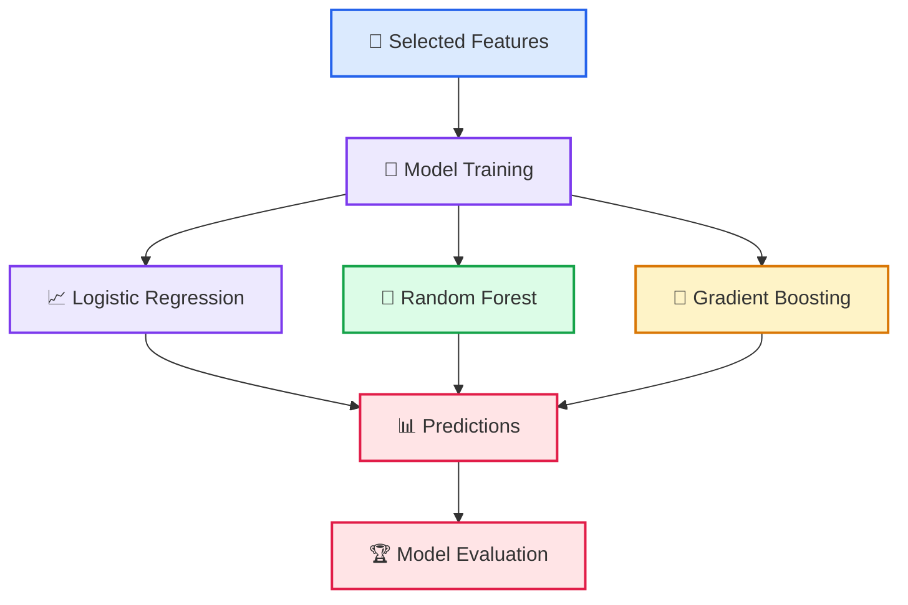

---

# 📈 19. Logistic Regression

Logistic Regression is used as a baseline classification model.

It estimates the probability that a transaction belongs to the fraud class.

Conceptually:

```text
Transaction Features
        ↓
Logistic Regression
        ↓
Fraud Probability
        ↓
Classification
```

For example:

```text
Fraud Probability = 0.92
        ↓
High Estimated Fraud Risk
```

### Advantages

- Simple
- Fast
- Interpretable
- Strong baseline
- Widely used in risk modeling

---

# 🌳 20. Random Forest

Random Forest is an ensemble Machine Learning algorithm consisting of multiple decision trees.

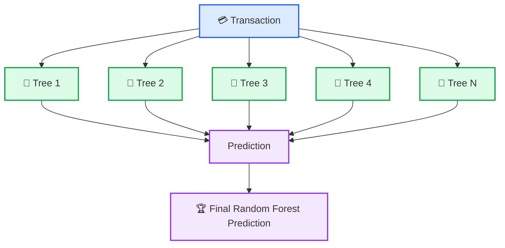

Random Forest can capture:

- Non-linear relationships
- Feature interactions
- Complex transaction patterns
- Different customer behaviors

---

# 🚀 21. Gradient Boosting

Gradient Boosting builds a sequence of models where each subsequent model attempts to improve the errors made by previous models.

```mermaid
flowchart LR

A["📊 Training Data"] --> B["🤖 Model 1"]
B --> C["❌ Errors"]
C --> D["🤖 Model 2"]
D --> E["❌ Remaining Errors"]
E --> F["🤖 Model 3"]
F --> G["🚀 Improved Prediction"]

classDef data fill:#DBEAFE,stroke:#2563EB,stroke-width:2px;
classDef model fill:#F3E8FF,stroke:#9333EA,stroke-width:2px;
classDef error fill:#FFE4E6,stroke:#E11D48,stroke-width:2px;
classDef result fill:#DCFCE7,stroke:#16A34A,stroke-width:2px;

class A data;
class B,D,F model;
class C,E error;
class G result;
```

Gradient Boosting is particularly useful for learning complex non-linear relationships.

---

# 📊 22. Model Evaluation

Because fraud detection is highly imbalanced, several metrics are used.

The evaluation framework is:

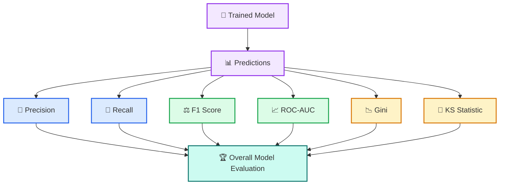

---

# 🎯 23. Accuracy

Accuracy measures the percentage of correctly classified observations.

```text
Accuracy
=
Correct Predictions
────────────────────
Total Predictions
```

However, accuracy should not be considered alone for fraud detection because of severe class imbalance.

---

# 🎯 24. Precision

Precision answers:

> Out of all transactions predicted as fraud, how many were actually fraudulent?

```text
Precision
=
True Positives
────────────────────────────
True Positives + False Positives
```

High precision means fewer legitimate transactions are incorrectly flagged as fraud.

---

# 🚨 25. Recall

Recall answers:

> Out of all actual fraudulent transactions, how many were successfully detected?

```text
Recall
=
True Positives
────────────────────────────
True Positives + False Negatives
```

Recall is particularly important in fraud detection because false negatives represent fraudulent transactions that the model failed to detect.

---

# ⚖️ 26. F1 Score

F1 Score combines Precision and Recall.

```text
F1
=
2 × Precision × Recall
──────────────────────
Precision + Recall
```

F1 Score is useful when both false positives and false negatives matter.

---

# 📈 27. ROC-AUC

ROC-AUC measures the ability of the model to distinguish between fraudulent and legitimate transactions across different classification thresholds.

Conceptually:

```text
AUC ≈ 0.50
   ↓
Random Discrimination

AUC → 1.00
   ↓
Strong Discrimination
```

A higher AUC indicates stronger discriminatory ability.

---

# 📉 28. Gini Coefficient

The Gini coefficient is another important measure of discriminatory power.

Its relationship with ROC-AUC is:

```text
Gini = 2 × AUC - 1
```

Therefore:

```text
AUC = 0.50
→ Gini = 0

AUC = 1.00
→ Gini = 1
```

Gini is widely used in financial risk and credit-risk modeling.

---

# 📐 29. KS Statistic

The Kolmogorov-Smirnov statistic measures the maximum separation between the cumulative distributions of the two classes.

Conceptually:

```text
Cumulative Distribution
│
│                  Fraud
│                ╭──────
│              ╭─╯
│            ╭─╯
│          ╭─╯
│        ╭─╯
│      ╭─╯
│    ╭─╯       Genuine
│  ╭─╯       ╭────────
│╭─╯       ╭─╯
└────────────────────────────
          ↑
          │
    Maximum Separation
          │
         KS
```

A larger KS value indicates stronger separation between the two populations.

---

# 🧪 30. Calibration Analysis

A model may have excellent discrimination while still producing poorly calibrated probabilities.

Calibration evaluates whether predicted probabilities correspond reasonably to observed outcomes.

For example:

```text
Predicted Probability
        ↓
       80%
        ↓
Observed outcome rate
should be reasonably
consistent with the
predicted probability
```

The project includes calibration analysis to evaluate the quality of model probabilities.

---

# 📊 31. Population Stability Index — PSI

Population Stability Index is used to measure changes in the distribution of a variable or model score between two populations.

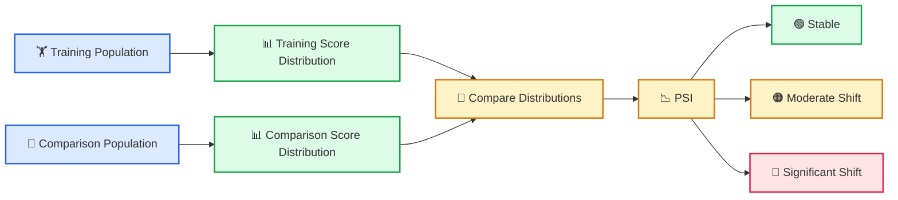

PSI is useful for identifying:

- Population changes
- Customer behavior changes
- Distribution shifts
- Potential model degradation

---

# 🏆 32. Model Performance Results

The evaluated models produced the following results:

| Model | Accuracy | Precision | Recall | F1 Score | ROC-AUC |
|---|---:|---:|---:|---:|---:|
| 📈 Logistic Regression | 99.79% | 47.00% | 33.00% | 39.00% | **99.82%** |
| 🌳 Random Forest | 99.93% | 79.37% | **89.29%** | 84.03% | **99.96%** |
| 🚀 Gradient Boosting | **99.97%** | **97.96%** | 85.71% | **91.43%** | 99.10% |

---

# 📌 33. Additional Risk Metrics

The project also calculates additional financial risk-modeling metrics.

<div align="center">

<table>
<tr>

<td align="center" width="33%">

<h3>📈 Gini</h3>

<h2>0.9964</h2>

</td>

<td align="center" width="33%">

<h3>📐 KS Statistic</h3>

<h2>0.9721</h2>

</td>

<td align="center" width="33%">

<h3>📊 PSI</h3>

<h2>0.000475</h2>

</td>

</tr>
</table>

</div>

---

# 🔎 34. Understanding the Results

### 📈 Logistic Regression

Logistic Regression provides a strong baseline and offers a relatively interpretable modeling approach.

### 🌳 Random Forest

Random Forest produces very strong discriminatory performance and high recall on the evaluated dataset.

### 🚀 Gradient Boosting

Gradient Boosting produces high precision and the highest F1 Score among the evaluated models.

The model results should be interpreted using multiple metrics rather than accuracy alone.

---

# 🧠 35. Why Accuracy Is Not Enough

Consider a hypothetical fraud dataset:

```text
100,000 Transactions

99,000 → 🟢 Genuine
 1,000 → 🔴 Fraud
```

Suppose a model predicts:

```text
100,000 → 🟢 Genuine
```

The accuracy would be:

```text
Accuracy = 99%
```

But:

```text
Fraud Detected = 0
```

Therefore, accuracy alone would provide a misleading picture.

A better evaluation considers:

```text
Accuracy
    +
Precision
    +
Recall
    +
F1 Score
    +
ROC-AUC
    +
Gini
    +
KS
```

---

# 🔬 36. Complete Technical Workflow

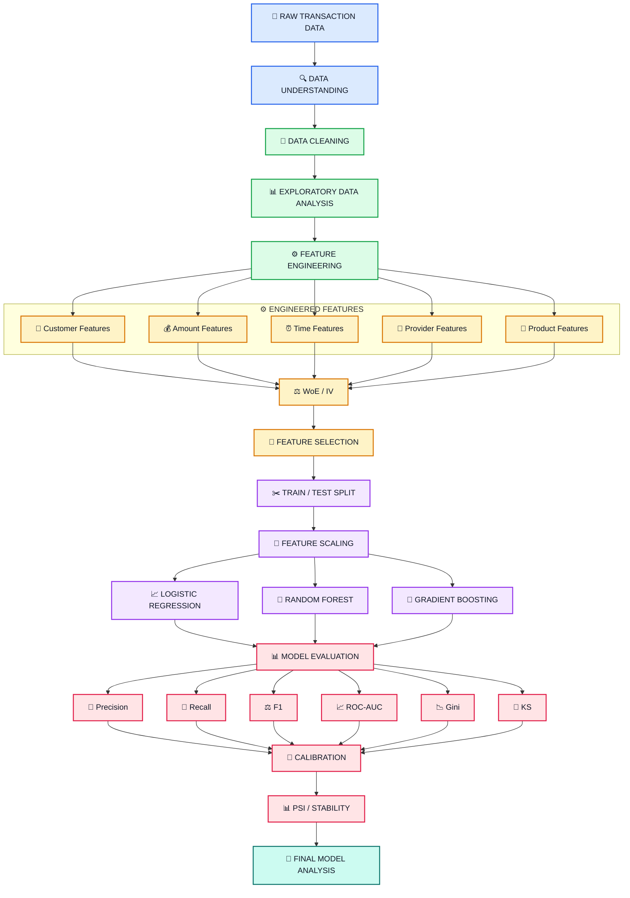

---

# 💳 37. Real-World Fraud Detection Flow

The trained model can conceptually be used in a transaction-scoring workflow like this:

```text
                  👤 CUSTOMER
                       │
                       ▼
                💳 TRANSACTION
                       │
          ┌────────────┼────────────┐
          │            │            │
          ▼            ▼            ▼
       💰 Amount     ⏰ Time      🏦 Provider
          │            │            │
          └────────────┼────────────┘
                       ▼
               ⚙️ FEATURE ENGINEERING
                       │
                       ▼
                🔬 RISK FEATURES
                       │
                       ▼
                 🤖 ML MODEL
                       │
                       ▼
                📊 FRAUD SCORE
                       │
                ┌──────┴──────┐
                ▼             ▼
             🟢 LOW         🔴 HIGH
              RISK           RISK
                │             │
                ▼             ▼
           LEGITIMATE      INVESTIGATE /
                           FLAG
```

> **Note:** The current project focuses on model development and evaluation. The above represents the conceptual real-world usage of the trained model and not a deployed real-time API.

---

# 📁 38. Project Structure

```text
Real-Time-Transaction-Fraud-Prediction-System/
│
├── 📓 Credit_Risk_Model (1).ipynb
│
├── 📄 Fraud_Risk_Project_Detailed_Report.pdf
│
├── 📄 README.md
│
├── 📜 LICENSE
│
├── 🚫 .gitignore
│
└── 📁 assets/
    │
    ├── 🖼️ fraud-detection-banner.png
    ├── 🖼️ transaction-fraud.png
    ├── 🖼️ feature-engineering.png
    ├── 🖼️ model-training.png
    └── 🖼️ model-evaluation.png
```

---

# 🛠️ 39. Technologies Used

| Category | Technologies |
|---|---|
| 🐍 Programming | Python |
| 📊 Data Analysis | Pandas, NumPy |
| 📈 Visualization | Matplotlib, Seaborn |
| 🤖 Machine Learning | Scikit-learn |
| ⚖️ Risk Modeling | WoE, IV |
| 🔬 Feature Selection | VIF, Lasso |
| 📈 Evaluation | Accuracy, Precision, Recall, F1 |
| 📊 Risk Metrics | ROC-AUC, Gini, KS |
| 🧪 Model Analysis | Calibration, PSI |
| 📓 Development | Jupyter Notebook |

---

# 📦 40. Python Libraries

The project uses standard Python data science and Machine Learning libraries.

```python
import pandas as pd
import numpy as np

import matplotlib.pyplot as plt
import seaborn as sns

from sklearn.model_selection import train_test_split
from sklearn.preprocessing import StandardScaler

from sklearn.linear_model import LogisticRegression
from sklearn.ensemble import RandomForestClassifier
from sklearn.ensemble import GradientBoostingClassifier

from sklearn.metrics import (
    accuracy_score,
    precision_score,
    recall_score,
    f1_score,
    roc_auc_score,
    confusion_matrix,
    classification_report,
    roc_curve
)
```

---

# ▶️ 41. How to Run the Project

## Step 1 — Clone the Repository

```bash
git clone <YOUR_GITHUB_REPOSITORY_URL>
```

---

## Step 2 — Navigate to the Project

```bash
cd Real-Time-Transaction-Fraud-Prediction-System
```

---

## Step 3 — Install Required Libraries

```bash
pip install pandas numpy matplotlib seaborn scikit-learn jupyter
```

---

## Step 4 — Launch Jupyter Notebook

```bash
jupyter notebook
```

Open:

```text
Credit_Risk_Model (1).ipynb
```

---

## Step 5 — Execute the Notebook

Run the notebook sequentially:

```text
1. 📂 Data Loading
        ↓
2. 🔍 Data Understanding
        ↓
3. 🧹 Data Cleaning
        ↓
4. 📊 Exploratory Data Analysis
        ↓
5. ⚙️ Feature Engineering
        ↓
6. ⚖️ WoE / IV
        ↓
7. 🔬 Feature Selection
        ↓
8. ✂️ Train / Test Split
        ↓
9. 🤖 Model Training
        ↓
10. 📊 Model Evaluation
        ↓
11. 🧪 Calibration
        ↓
12. 📉 PSI
        ↓
13. 🏆 Final Analysis
```

---

# 🧪 42. End-to-End Machine Learning Pipeline

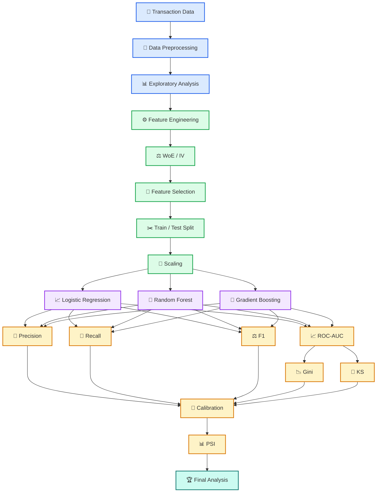

---

# 💼 43. Business Interpretation

Fraud detection models are designed to support decisions such as:

```text
Transaction
     │
     ▼
Risk Assessment
     │
     ▼
Fraud Probability
     │
     ├─────────────────┐
     │                 │
     ▼                 ▼
 Low Risk          High Risk
     │                 │
     ▼                 ▼
Allow / Process    Review / Flag
```

The exact decision threshold depends on the business objective and the relative cost of:

- False positives
- False negatives
- Fraud losses
- Customer friction

---

# ⚠️ 44. Important Project Scope

This repository focuses on:

> **Training and evaluating Machine Learning models for transaction fraud detection.**

The project is primarily a **Machine Learning and risk analytics project**.

The following production components are outside the current scope:

```text
❌ REST API
❌ Web Dashboard
❌ Database Server
❌ Cloud Deployment
❌ Authentication
❌ Production Model Serving
❌ Live Transaction Streaming
```

The core workflow is:

```text
DATA
  ↓
FEATURE ENGINEERING
  ↓
MODEL TRAINING
  ↓
MODEL EVALUATION
  ↓
RISK ANALYSIS
```

---

# ⚠️ 45. Important Modeling Considerations

Before using a fraud model in a production financial environment, additional validation should be performed.

### 🔹 Data Leakage

Features should only use information that would have been available at the time of the transaction.

### 🔹 Time-Based Validation

Fraud patterns can change over time, so out-of-time validation can provide additional confidence.

### 🔹 Class Imbalance

Fraud cases are generally much rarer than legitimate transactions.

### 🔹 Threshold Optimization

The default classification threshold may not be optimal for every business objective.

### 🔹 Probability Calibration

Predicted probabilities should be evaluated before being interpreted as actual risk probabilities.

### 🔹 Model Stability

Model performance should be monitored as customer behavior and transaction patterns change.

---

# 🚀 46. Future Improvements

The project can be extended with:

```text
🔹 Time-Based Validation
        ↓
🔹 Out-of-Time Testing
        ↓
🔹 Advanced Class Imbalance Techniques
        ↓
🔹 XGBoost / LightGBM
        ↓
🔹 Threshold Optimization
        ↓
🔹 SHAP Explainability
        ↓
🔹 Model Monitoring
        ↓
🔹 Drift Detection
        ↓
🔹 Real-Time Inference
```

Potential future improvements include:

- XGBoost
- LightGBM
- SHAP
- Explainable AI
- Temporal validation
- Advanced sampling techniques
- Threshold optimization
- Model monitoring
- Real-time fraud scoring

---

# 📚 47. Key Concepts Demonstrated

## 📊 Data Science

- Data Cleaning
- Exploratory Data Analysis
- Feature Engineering
- Data Transformation
- Feature Selection

## 🤖 Machine Learning

- Binary Classification
- Logistic Regression
- Random Forest
- Gradient Boosting
- Lasso Regularization
- Cross Validation

## 💳 Financial Risk Analytics

- Weight of Evidence
- Information Value
- Gini Coefficient
- KS Statistic
- Population Stability Index
- Probability Calibration

## 📈 Model Evaluation

- Confusion Matrix
- Accuracy
- Precision
- Recall
- F1 Score
- ROC Curve
- ROC-AUC

---

# 🧠 48. What the Model Learns

The Machine Learning model attempts to learn relationships between transaction/customer characteristics and the fraud label.

Conceptually:

```text
Historical Transactions
          │
          ▼
   Customer Behavior
          +
   Transaction Behavior
          +
     Time Patterns
          +
   Amount Patterns
          +
   Provider/Product
          │
          ▼
    Feature Engineering
          │
          ▼
      ML Algorithm
          │
          ▼
    Learned Patterns
          │
          ▼
 Fraud / Genuine Prediction
```

---

# 🏁 49. Final Takeaway

This project demonstrates an end-to-end Machine Learning approach to financial transaction fraud detection.

The complete methodology is:

```text
📂 Raw Transaction Data
        ↓
🔍 Data Understanding
        ↓
🧹 Data Cleaning
        ↓
📊 Exploratory Data Analysis
        ↓
⚙️ Feature Engineering
        ↓
⚖️ WoE / IV
        ↓
🔬 Feature Selection
        ↓
✂️ Train / Test Split
        ↓
🤖 Machine Learning
        ↓
📊 Model Evaluation
        ↓
📈 ROC-AUC / Gini
        ↓
📐 KS Statistic
        ↓
🧪 Calibration
        ↓
📊 PSI
        ↓
🏆 Final Model Analysis
```

The project combines Machine Learning with statistical risk-modeling techniques to identify patterns associated with fraudulent financial transactions.

---

# 📌 50. Final Results Summary

<div align="center">

<table>
<tr>

<td align="center">

<h3>📈 Logistic Regression</h3>

<strong>ROC-AUC</strong>

<h2>99.82%</h2>

</td>

<td align="center">

<h3>🌳 Random Forest</h3>

<strong>ROC-AUC</strong>

<h2>99.96%</h2>

</td>

<td align="center">

<h3>🚀 Gradient Boosting</h3>

<strong>F1 Score</strong>

<h2>91.43%</h2>

</td>

</tr>
</table>

<br>

<table>
<tr>

<td align="center">

<h3>📉 Gini</h3>

<h2>0.9964</h2>

</td>

<td align="center">

<h3>📐 KS</h3>

<h2>0.9721</h2>

</td>

<td align="center">

<h3>📊 PSI</h3>

<h2>0.000475</h2>

</td>

</tr>
</table>

</div>

---

# 👨‍💻 51. Author

<h2 align="center">Goutam Agarwal</h2>

<p align="center">

🎓 <strong>Master's in Industrial Engineering & Operations Research — IIT Bombay</strong>

</p>

### Areas of Interest

- 🤖 Machine Learning
- 📊 Data Science
- 📈 Data Analytics
- 💳 Risk Analytics
- 🧠 Artificial Intelligence
- ⚙️ Operations Research

---

# ⭐ 52. Repository

If you find this project useful:

- ⭐ Star the repository
- 🍴 Fork the repository
- 📚 Explore the notebook
- 💡 Build upon the project

---

<p align="center">

# 🛡️ Machine Learning for Smarter Fraud Detection 💳

<strong>Built with Python • Machine Learning • Statistical Risk Analytics</strong>

</p>

<p align="center">

Made with ❤️ by <strong>Goutam Agarwal</strong>

</p>
